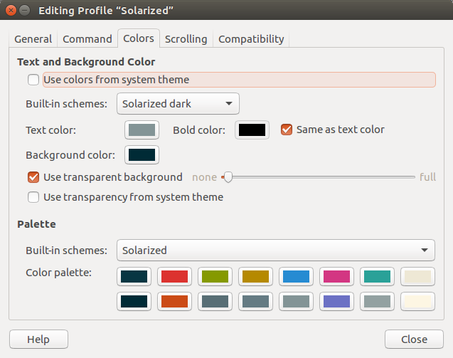
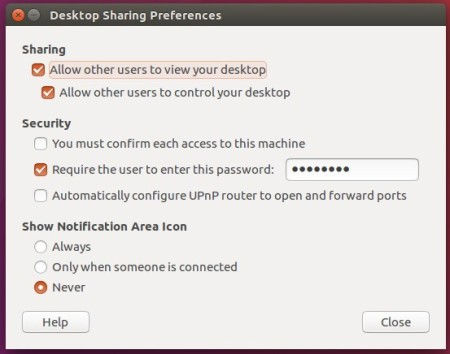
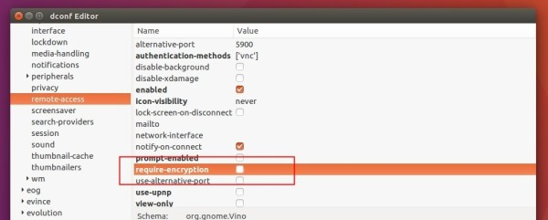
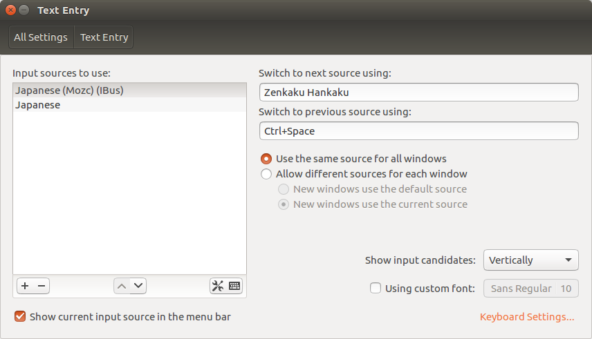

# Setup Ubuntu 16.04

## Remarks

For my own environment.  

Some libraries are installed with specific versions (around GPU).

## General Apps

- Update libraries

  - `sudo apt update`
  - `sudo apt upgrade`

- Install via Ubuntu Software

  - Chromium
  - FileZilla
  - Screen Ruler
  - VLC

- Others

  - Typora

    ```bash
    # sudo apt-key adv --keyserver keyserver.ubuntu.com --recv-keys BA300B7755AFCFAE
    wget -qO - https://typora.io/linux/public-key.asc | sudo apt-key add -
    
    # add Typora's repository
    sudo add-apt-repository 'deb https://typora.io/linux ./'
    sudo apt-get update
    
    # install typora
    sudo apt-get install typora
    ```

  - Basic libraries

    `sudo apt install git vim tmux curl make cmake gnome-system-monitor openssh-server` 
    

## Zsh + Prezto

```bash
# Install zsh
sudo apt instal zsh
# Launch zsh (press 'q' for configuration)
zsh

# Clone Prezto
git clone --recursive https://github.com/sorin-ionescu/prezto.git "${ZDOTDIR:-$HOME}/.zprezto"

# Create links

# Power-fonts
sudo apt install fonts-powerline

# Set Zsh as your default shell
chsh -s /bin/zsh

```

- Apply solarized color

`Terminal`->`Preferences`->`Profiles`->`Edit`



## Docker

Version: `5:18.09.0~3-0~ubuntu-xenial`

```bash
# Install packages to allow apt to use a repository over HTTPS
sudo apt install -y \
    apt-transport-https \
    ca-certificates \
    curl \
    gnupg-agent \
    software-properties-common
    
# Add Docker’s official GPG key
curl -fsSL https://download.docker.com/linux/ubuntu/gpg | sudo apt-key add -

# Set up the stable repository.
sudo add-apt-repository \
   "deb [arch=amd64] https://download.docker.com/linux/ubuntu \
   $(lsb_release -cs) \
   stable"
sudo apt update

# Install the latest version of Docker Engine - Community and containerd
DOCKER_VER="5:18.09.0~3-0~ubuntu-xenial"
sudo apt install -y docker-ce=${DOCKER_VER} docker-ce-cli=${DOCKER_VER} containerd.io

# Manage Docker as a non-root user
sudo groupadd docker
sudo usermod -aG docker $USER

# After re-login, verify that Docker Engine - Community is installed correctly by running the hello-world image
docker run hello-world

# Configure Docker to start on boot
sudo systemctl enable docker
```

## Nvidia Driver

Version: `418`

```bash
sudo add-apt-repository ppa:graphics-drivers/ppa
sudo apt update
sudo apt install nvidia-418
```

## nvidia-docker2

Version: `2.0.3+docker18.09.0-1`

```bash
# Check whether docker version is lower than 19
docker --version

# Install nvidia-docker2
NVIDIA_DOCKER_VER="2.0.3+docker18.09.0-1"
NVIDIA_RUNTIME_VER="2.0.0+docker18.09.0-1"
sudo apt install nvidia-docker2=${NVIDIA_DOCKER_VER} nvidia-container-runtime=${NVIDIA_RUNTIME_VER}

# Reload the Docker daemon configuration
sudo pkill -SIGHUP dockerd

# Verify the install
docker run --runtime=nvidia --rm nvidia/cuda nvidia-smi
```

## pyenv

```bash
# Clone pyenv and virtualenv plugin
git clone git://github.com/yyuu/pyenv.git ${HOME}/.pyenv
git clone https://github.com/yyuu/pyenv-virtualenv.git ~/.pyenv/plugins/pyenv-virtualenv

# Instal related packages
sudo apt install -y make build-essential libssl-dev zlib1g-dev libbz2-dev \
libreadline-dev libsqlite3-dev llvm libncurses5-dev libncursesw5-dev \
xz-utils tk-dev libffi-dev liblzma-dev python-openssl

# Show available python
pyenv install --list

# Install specific python
pyenv install 3.8.0

# Set the version as a global default
pyenv global 3.8.0
```

## Remote Desktop

In Ubuntu, open `Desktop Sharing` app, and change configurations as bellow.



Disable encryption (due to [this bug](https://bugs.launchpad.net/ubuntu/+source/vino/+bug/1281250))

```bash
sudo apt install dconf-editor
```

Open `dconf Editor` app, and change configurations as bellow.



Try to remote desktop access from another machine. 


## Japanese Input

```bash
# Install Mozc
sudo apt-get install ibus-mozc
# Restart ibus
killall ibus-daemon
ibus-daemon -d -x &
```

Set "Text Entry" like this.



